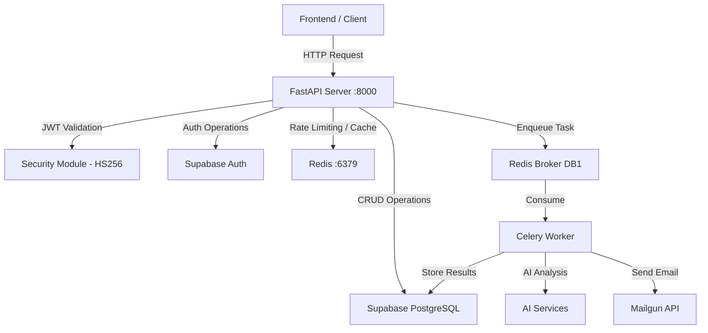
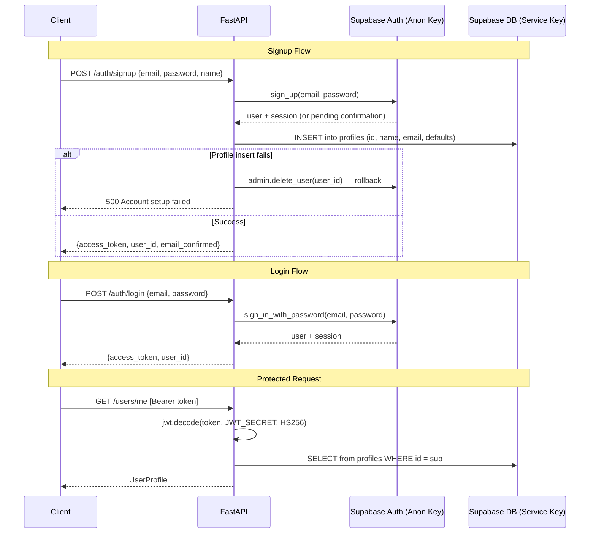
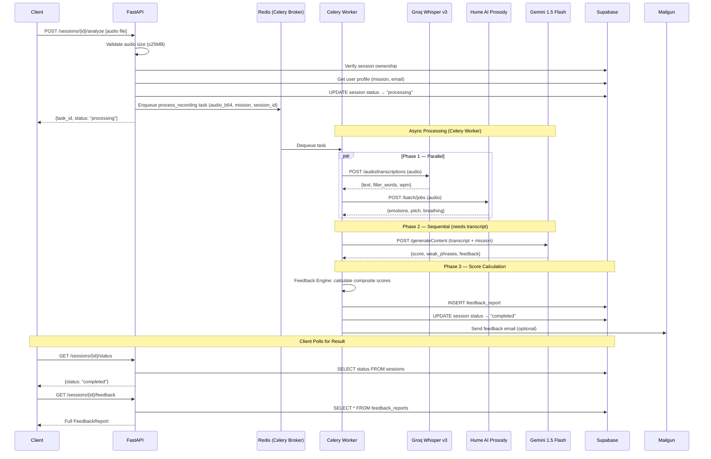
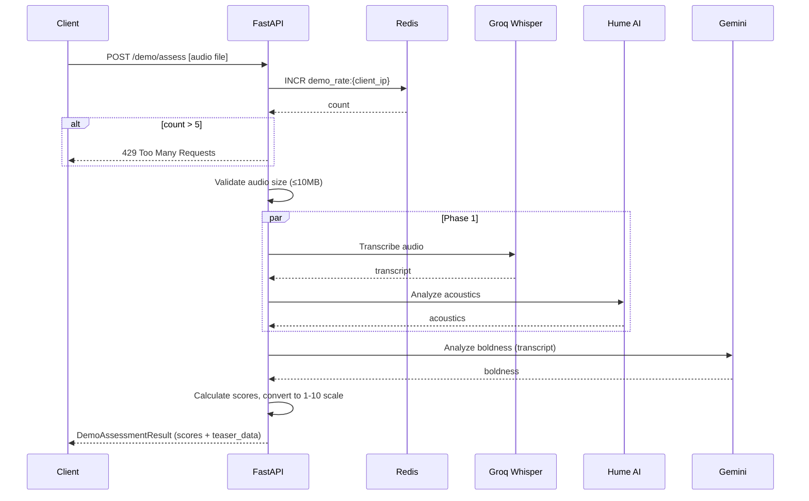

# TalkKing Backend — Complete Reference

## Project Overview

TalkKing is an AI-powered communication coaching platform. The backend is a **FastAPI** application that records users' speech, analyzes it across multiple dimensions using three AI providers in parallel, and returns detailed feedback to help users improve their speaking skills. It uses **Supabase** for authentication and PostgreSQL storage, **Redis** for caching and as a Celery message broker, **Celery** for asynchronous audio analysis tasks, and **Mailgun** for email notifications. The backend serves a React frontend via a RESTful JSON API under the `/api/v1` prefix.

---

## Tech Stack

| Layer | Technology | Purpose |
|-------|-----------|---------|
| Framework | FastAPI (Python 3.11+) | REST API server |
| Auth | Supabase Auth | JWT-based authentication (email/password + OAuth) |
| Database | Supabase (PostgreSQL) | User profiles, sessions, feedback reports |
| Cache / Broker | Redis 7 | Rate limiting, Celery task broker, result backend |
| Task Queue | Celery 5 | Async audio analysis pipeline |
| Transcription | Groq Whisper v3 | Speech-to-text + filler word detection |
| Vocal Analysis | Hume AI (Prosody) | Emotion/acoustic analysis (pitch, breathing, monotone) |
| Language Analysis | Google Gemini 1.5 Flash | Boldness/confidence scoring from transcript |
| Email | Mailgun | Post-analysis feedback notification emails |
| Monitoring | Sentry | Error tracking and performance monitoring |
| Containerization | Docker + Docker Compose | Production deployment |

---

## Database Tables (Supabase)

| Table | Key Columns | Purpose |
|-------|-------------|---------|
| `profiles` | id (FK to auth.users), name, email, avatar, mission, weakness, current_level, total_sessions, streak_days, best_score, average_wpm | User profile and progress tracking |
| `sessions` | id, user_id, type (video/audio), prompt_type, prompt, duration, status (created/processing/completed/failed), error, created_at | Recording session metadata |
| `feedback_reports` | session_id, user_id, overall_score, clarity, vocal_quality, musicality, boldness, eye_contact, body_language, improvements, strengths, personalized_tips, recommended_layer, created_at | AI analysis results per session |

---

## Features

### 1. Authentication
- Email/password signup with Supabase Auth (supports email confirmation flow)
- Email/password login returning a JWT access token
- OAuth login (Google, GitHub) via Supabase implicit flow
- OAuth PKCE code exchange fallback endpoint
- Automatic profile creation on signup (with rollback if profile insert fails)
- Local JWT validation using HS256 (no network round-trip to Supabase per request)

### 2. User Profile Management
- Fetch authenticated user's profile (`GET /users/me`)
- Update profile fields: name, avatar, mission, weakness (`PATCH /users/me`)
- Profile tracks: current_level, total_sessions, streak_days, best_score, average_wpm, common_filler_words, common_weak_phrases, improvement_areas, strengths

### 3. Recording Sessions
- Create a new recording session (video or audio, with prompt type: random/specific/free-flow)
- Upload audio and enqueue async AI analysis via Celery
- Poll session status (processing → completed/failed)
- Session ownership enforcement — users can only access their own sessions

### 4. AI Analysis Pipeline (3-phase parallel fan-out)
- **Phase 1 (parallel):** Groq Whisper transcription + Hume AI acoustic analysis (both need raw audio)
- **Phase 2 (sequential):** Gemini boldness analysis (needs transcript text from Phase 1)
- **Phase 3:** Composite score calculation via feedback engine
- Scores 6 dimensions: Clarity, Vocal Quality, Musicality, Boldness, Eye Contact (optional), Body Language (optional)
- Weighted average overall score (0–100)
- Generates: improvements list, strengths list, personalized tips, recommended confidence layer (1–6)

### 5. Feedback Reports
- Retrieve full feedback for a completed session
- Each report contains per-dimension scores, sub-metrics (filler words, WPM, pitch variation, weak phrases, etc.), and textual feedback

### 6. Progress Tracking
- Historical progress data from all feedback reports
- Returns time-series of dimension scores for charts

### 7. Session History
- Paginated list of past sessions with metadata
- Supports `page` and `limit` query parameters (max 50 per page)

### 8. Anonymous Demo Assessment
- Public endpoint (no auth required) for demo/trial users
- Stricter audio size limit (10MB vs 25MB for authenticated)
- Runs analysis synchronously (not via Celery — small audio only)
- IP-based rate limiting: 5 requests per hour per IP (supports X-Forwarded-For for reverse proxy)
- Returns scores on 1–10 scale with teaser data for signup conversion

### 9. Email Notifications
- Sends feedback summary email after analysis completes
- Includes overall score, top strength, and top improvement area
- Sent via Mailgun API

### 10. Health Check
- `GET /health` — returns Redis and Supabase connectivity status
- No authentication required
- Returns `ok` or `degraded` overall status

---

## API Endpoints

### Authentication (Public — no auth required)

| Method | Path | Description | Request Body | Response |
|--------|------|-------------|--------------|----------|
| `POST` | `/api/v1/auth/signup` | Register new user | `{ email, password, name, redirect_to? }` | `{ access_token, user_id, message, email_confirmed }` |
| `POST` | `/api/v1/auth/login` | Login existing user | `{ email, password }` | `{ access_token, user_id, message, email_confirmed }` |
| `GET` | `/api/v1/auth/oauth/{provider}` | Initiate OAuth (google/github) | Query: `redirect_to?` | 302 Redirect to Supabase OAuth URL |
| `POST` | `/api/v1/auth/oauth/callback` | Exchange PKCE code for session | `{ code }` | `{ access_token, user_id, message, email_confirmed }` |

### Users (Protected — Bearer token required)

| Method | Path | Description | Request Body | Response |
|--------|------|-------------|--------------|----------|
| `GET` | `/api/v1/users/me` | Get current user's profile | — | `UserProfile` object |
| `PATCH` | `/api/v1/users/me` | Update profile fields | `{ name?, avatar?, mission?, weakness? }` | Updated `UserProfile` object |

**Mission types:** `tech-interview`, `sales-pitch`, `conflict-resolution`, `storytelling`, `dating`
**Weakness types:** `filler-words`, `sound-nervous`, `monotone`, `weak-language`, `eye-contact`, `body-language`

### Sessions (Protected)

| Method | Path | Description | Request Body | Response |
|--------|------|-------------|--------------|----------|
| `POST` | `/api/v1/sessions` | Create recording session | `{ type: "video"/"audio", prompt_type: "random"/"specific"/"free-flow", prompt?, duration }` | `{ session_id, status: "created" }` |
| `POST` | `/api/v1/sessions/{session_id}/analyze` | Upload audio for analysis | `multipart/form-data` with `audio` file | `{ task_id, status: "processing", message }` |
| `GET` | `/api/v1/sessions/{session_id}/status` | Poll analysis status | — | `{ session_id, status, error? }` |

### Feedback (Protected)

| Method | Path | Description | Response |
|--------|------|-------------|----------|
| `GET` | `/api/v1/sessions/{session_id}/feedback` | Get feedback report | `FeedbackReport` object (6 dimensions + tips + recommendations) |

### Progress (Protected)

| Method | Path | Description | Response |
|--------|------|-------------|----------|
| `GET` | `/api/v1/progress` | Get historical scores | Array of `{ date, overall_score, clarity, vocal_quality, musicality, boldness, eye_contact?, body_language? }` |

### History (Protected)

| Method | Path | Description | Query Params | Response |
|--------|------|-------------|-------------|----------|
| `GET` | `/api/v1/history` | Paginated session list | `page` (default 1), `limit` (default 10, max 50) | `{ sessions: [...], pagination: { page, limit, total, total_pages } }` |

### Demo (Public — rate-limited)

| Method | Path | Description | Request Body | Response |
|--------|------|-------------|--------------|----------|
| `POST` | `/api/v1/demo/assess` | Anonymous demo assessment | `multipart/form-data` with `audio` file (max 10MB) | `DemoAssessmentResult` (scores on 1–10 scale + teaser data) |

### Health (Public)

| Method | Path | Description | Response |
|--------|------|-------------|----------|
| `GET` | `/health` | Service health check | `{ status: "ok"/"degraded", service, env, checks: { redis, supabase } }` |

---

## Architecture Flow Diagrams

### Overall Request Flow



### Authentication Flow



### AI Analysis Pipeline Flow



### Demo Assessment Flow (Synchronous)



---

## Scoring System

### 6 Dimensions

| Dimension | Source | Key Metrics |
|-----------|--------|-------------|
| **Clarity** | Groq Whisper | Filler word count, WPM (ideal: 120–160), filler word density |
| **Vocal Quality** | Hume AI | Breathing pattern, vocal fry, raspiness, emotion-derived confidence |
| **Musicality** | Hume AI | Pitch variation (flat/moderate/dynamic), monotone detection |
| **Boldness** | Gemini | Weak/hedging phrases (e.g., "I think", "maybe", "kind of"), confident language usage |
| **Eye Contact** | Frontend (optional) | Gaze stability, camera-look ratio |
| **Body Language** | Frontend (optional) | Posture, nervous gestures |

### Overall Score Calculation

- Audio-only (4 dimensions): 25% each
- Audio + eye contact: 22% / 22% / 22% / 22% / 12%
- Audio + body language: 22% / 22% / 22% / 22% / 12%
- Full video (6 dimensions): 20% / 20% / 20% / 20% / 10% / 10%

### Confidence Layer Mapping

| Overall Score | Layer | Level |
|--------------|-------|-------|
| 0–39 | 1 | Beginner |
| 40–54 | 2 | Elementary |
| 55–69 | 3 | Intermediate |
| 70–79 | 4 | Upper-Intermediate |
| 80–89 | 5 | Advanced |
| 90–100 | 6 | Expert |

---

## Project Structure

```
Backend/
├── app/
│   ├── main.py                    # FastAPI app factory, lifespan, health check, CORS
│   ├── config.py                  # Pydantic Settings (env vars)
│   ├── dependencies.py            # Shared DI re-exports
│   ├── core/
│   │   ├── security.py            # JWT validation (HS256, local)
│   │   ├── supabase_client.py     # Supabase client singletons (service + anon key)
│   │   ├── redis_client.py        # Lazy async Redis pool
│   │   └── exceptions.py          # Custom HTTP exceptions
│   ├── api/
│   │   ├── router.py              # Aggregates all v1 routers
│   │   └── v1/
│   │       ├── auth.py            # Signup, login, OAuth
│   │       ├── users.py           # GET/PATCH /users/me
│   │       ├── sessions.py        # Create session, upload audio, poll status
│   │       ├── feedback.py        # GET feedback report
│   │       ├── progress.py        # GET progress time-series
│   │       ├── history.py         # GET paginated session history
│   │       └── assessment.py      # POST /demo/assess (public, rate-limited)
│   ├── schemas/
│   │   ├── user.py                # UserProfile, UserProfileUpdate
│   │   ├── session.py             # RecordingSession
│   │   ├── feedback.py            # FeedbackReport + sub-dimension schemas
│   │   ├── assessment.py          # DemoAssessmentResult + DemoTeaserData
│   │   ├── progress.py            # ProgressData
│   │   └── achievement.py         # Achievement
│   ├── services/
│   │   ├── ai_orchestrator.py     # 3-phase parallel fan-out coordinator
│   │   ├── groq_service.py        # Groq Whisper v3 transcription
│   │   ├── hume_service.py        # Hume AI prosody/emotion analysis
│   │   ├── gemini_service.py      # Gemini 1.5 Flash boldness analysis
│   │   ├── feedback_engine.py     # Composite score calculation (6 dimensions)
│   │   ├── user_service.py        # Profile CRUD operations
│   │   ├── email_service.py       # Mailgun email delivery
│   │   └── audio_utils.py         # Audio validation and duration estimation
│   └── tasks/
│       ├── celery_app.py          # Celery configuration
│       └── analysis.py            # process_recording async task
├── tests/                         # Pytest test suite (52 tests)
├── infra/                         # Nginx, Redis config, supervisor
├── Dockerfile                     # Multi-stage build (builder + runtime)
├── docker-compose.yml             # Redis + API + Celery Worker + Flower
├── docker-compose.prod.yml        # Production overrides
├── Makefile                       # Dev commands (dev, test, lint, docker)
├── requirements.txt               # Production dependencies
└── requirements-dev.txt           # Dev/test dependencies (pytest, ruff, mypy)
```

---

## Environment Variables

| Variable | Required | Description |
|----------|----------|-------------|
| `ENVIRONMENT` | No | `development` / `staging` / `production` (default: development) |
| `SUPABASE_URL` | Yes | Supabase project URL |
| `SUPABASE_SERVICE_KEY` | Yes | Supabase service role key (bypasses RLS) |
| `SUPABASE_JWT_SECRET` | Yes | Supabase JWT secret for local token validation |
| `SUPABASE_ANON_KEY` | Yes | Supabase anon key (for auth operations with RLS) |
| `GROQ_API_KEY` | Yes | Groq API key for Whisper transcription |
| `GEMINI_API_KEY` | Yes | Google Gemini API key for boldness analysis |
| `HUME_API_KEY` | Yes | Hume AI API key for prosody analysis |
| `REDIS_URL` | No | Redis URL (default: `redis://127.0.0.1:6379/0`) |
| `CELERY_BROKER_URL` | No | Celery broker URL (default: `redis://127.0.0.1:6379/1`) |
| `CORS_ORIGINS` | No | Allowed origins (default includes talkking.me + localhost) |
| `SENTRY_DSN` | No | Sentry DSN for error monitoring |
| `MAILGUN_API_KEY` | No | Mailgun API key for email notifications |
| `MAILGUN_DOMAIN` | No | Mailgun sending domain (default: `mail.talkking.me`) |
